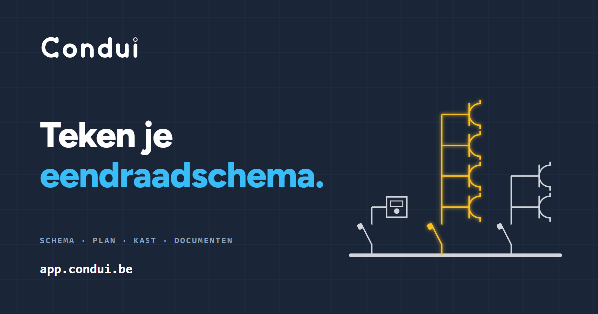

# Condui Community



**Explore Condui:** [Website](https://condui.be/en/) · [Try the browser demo](https://app.condui.be/demo) · [About Community](https://condui.be/en/open-source/) · [Community setup guide](https://docs.condui.be/en/community-edition/) · [Pricing](https://condui.be/en/pricing) · [Belgian electrical rules guide](https://arei.condui.be/en/knowledge/)

Condui Community is the local, self-hosted edition of Condui, a tool for creating and maintaining
Belgian electrical installation diagrams. It is intended for people who want to keep their project
files and working environment under their own control.

The Community edition works without sign-in or a managed Condui service. Projects are stored in the
browser on the device running the application, or optionally in a folder on the server that runs
it, and can be downloaded as portable project archives.
These archives are fully compatible in both directions with the hosted, paid Condui edition: the
same project can be opened and edited in either edition and moved between them without conversion.

## What you can do

Condui Community includes the local editing workflow:

- create and edit one-wire diagrams;
- create and edit situation plans and panel layouts;
- store projects locally in the browser, or on your own server so every device on your network sees
  the same projects;
- import and download portable Condui project archives;
- import supported plan files using the bundled local conversion service;
- export finished diagrams to PDF; and
- open the included demo project without saving changes to your project list.

The interface is available in Dutch, French, and English.

## What is different from the hosted Condui product

Condui Community is deliberately local and meant for a single user. Accounts, managed storage,
multi-user collaboration, sharing, project history, managed backups, and hosted integrations are
not included. Optional server storage keeps one shared project list for everyone who can reach the
installation; it has no user accounts.

Project templates are a hosted Condui feature and are not included in Community. Community projects
start from an empty local project or an imported project archive.

PDF exports contain the rendered document only. They do not contain an embedded editable Condui
project. Download and back up the project archive separately if you want to edit the project later.

Community installations are operated by the person or organization running them. There is no managed
backup, uptime guarantee, automatic server maintenance, or data recovery service.

## Run as a container

The published OCI image is available from GitHub Container Registry. Docker Compose pulls the
current image whenever you explicitly start or update the installation:

```bash
docker compose up -d
```

Open <http://localhost:8080> after the container has started. Stop it with:

```bash
docker compose down
```

This does not install a background auto-updater. Running `docker compose up -d` again checks GHCR,
pulls a changed image, and recreates the container when necessary.

Other OCI-compatible tools can use the same image. For example, with Podman:

```bash
podman pull ghcr.io/xoliul/condui-community:latest
podman run --rm -p 8080:8080 ghcr.io/xoliul/condui-community:latest
```

The container serves the application and the local file-conversion endpoints it needs. It does not
require a database or a separate backend service.

If the browser shows a blank page, look at the browser developer console rather than Docker logs.
The application runs in the browser; container logs only show whether the local web server started.

To build the image from the checked-out source instead:

```bash
docker build -t condui-community:local .
docker run --rm -p 8080:8080 condui-community:local
```

## Server storage and access

By default every browser keeps its own project list. To keep projects, folders, the installer
profile, favourite symbols, and editor preferences (language, theme, placing symbols manually,
default layout) on the server instead, map a folder to `/data`:

```yaml
services:
  condui:
    image: ghcr.io/xoliul/condui-community:latest
    restart: unless-stopped
    ports:
      - "8080:8080"
    volumes:
      - ./condui-data:/data
```

Server storage is only active when that folder is mapped. Each project is a JSON file in
`condui-data/projects`; back up the whole folder to back up your projects. The first time a browser
opens an installation with server storage, it offers to move the projects it already has to the
server. If two devices edit the same project, the second save asks which version to keep instead of
overwriting the other.

Without a password, Condui Community only answers devices on its own network (including private
overlays such as Tailscale) and refuses visitors from the internet. To use it from elsewhere, set a
password of at least eight characters:

```yaml
    environment:
      CONDUI_PASSWORD: "your own password"
```

Once set, the password is required on every device, also at home. The browser asks for it once.
Over plain HTTP the password is sent unencrypted, so put Condui behind a reverse proxy with HTTPS
before reaching it over the internet.

Condui decides whether a visitor is on your network from their address and, when Docker hides that
address (Docker Desktop on Windows and macOS), from the address typed in the browser. A real
internet domain name then counts as outside your network, even when it points to a local address.

## Run from source

Condui Community requires Node.js 24 and npm.

```bash
npm install
npm run build
npm start
```

Then open <http://localhost:8080>.

`npm start` listens on loopback only by default; use `HOST=0.0.0.0 npm start` to expose it on the LAN.
Set `CONDUI_DATA_DIR` to an existing folder to enable server storage when running from source.

This repository is generated from Condui's private development repository. Generated Community
snapshots contain only the source and assets required by the local edition.

## Project data and backups

Without server storage, projects are stored in the browser profile used to open Condui Community.
Clearing browser data, deleting that profile, or losing the device can remove locally stored projects.
With server storage, projects live in the mapped folder; back up that folder.

Use the project download function regularly and keep the resulting archive somewhere you back up.
The portable archive is the editable source of the project. The PDF is an output document, not a
replacement for that archive.

The archive structure and compatibility expectations are documented in
[`docs/project-file-format.md`](docs/project-file-format.md).

## Updates

Run the normal Compose command again to check for and install a newer published image:

```bash
docker compose up -d
```

Back up important project archives before updating. Compatibility with supported project archives is
maintained through the documented import and migration path, but keeping your own backups remains
important.

## Licence and permitted use

Condui Community is source-available under the
[PolyForm Perimeter License 1.0.1](LICENSE). In practical terms:

- you may use it personally or professionally, including for paid electrical work;
- you may study, modify, fork, and redistribute the Community source;
- you must include the licence and required notices when you redistribute it;
- you may build independent tools that read and write the documented Condui project format;
- you may not sell, rebrand, host, or otherwise offer Condui Community or a modified version as a
  competing product or service, even if that substitute is offered for free; and
- the Condui name and visual identity are not licensed for use on a fork or competing product.

This summary is informational. The [`LICENSE`](LICENSE) file contains the authoritative terms. Contact
Studio Oplos VOF if you need permission beyond those terms.

## Contributions and support

Report bugs, suggest improvements, and submit pull requests in the
[Community repository](https://github.com/Xoliul/condui-community). Read
[CONTRIBUTING.md](CONTRIBUTING.md) before submitting a contribution, including the contribution
licence terms and the required acknowledgement for pull requests.

Accepted changes are integrated into Condui's canonical development repository and included in a
subsequent Community snapshot. Community support is provided on a best-effort basis.

Condui Community can assist with drawing and documenting an installation, but it does not guarantee
regulatory compliance or acceptance by an inspection body. The installer and project owner remain
responsible for the installation and its documentation.
